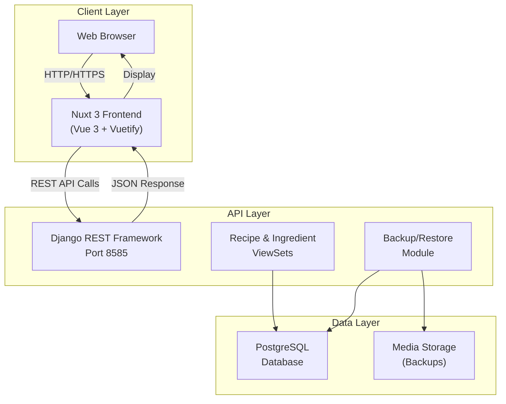
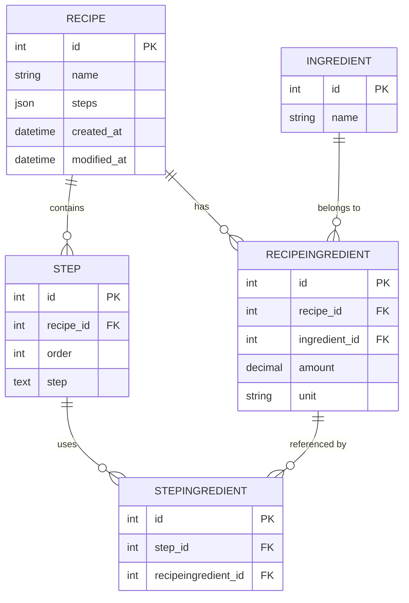
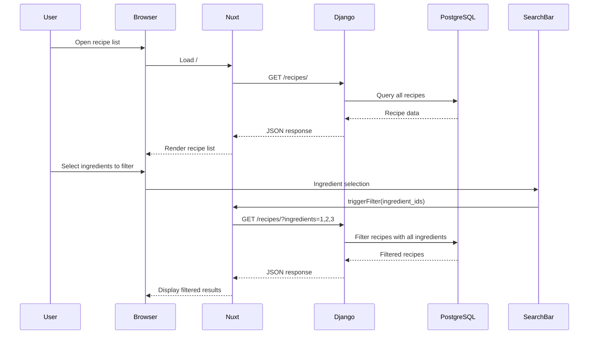
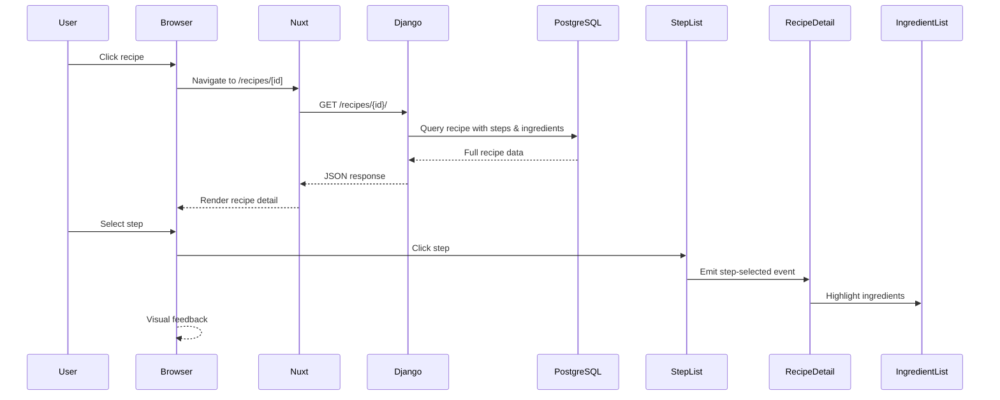
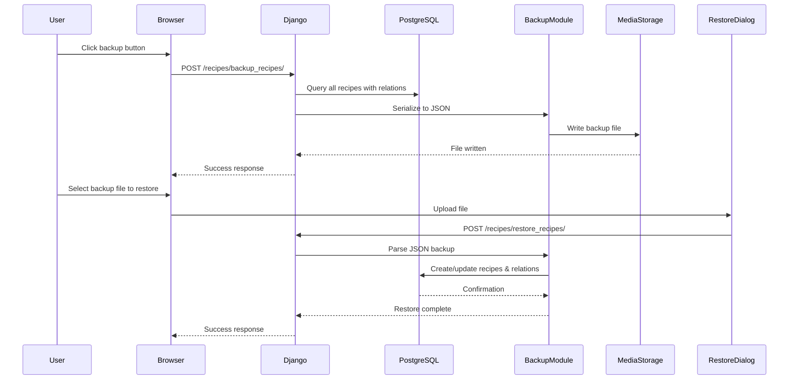

# Local Recipe Server

A personal recipe web service for managing, storing, and searching recipes across your home network. Built with Django REST Framework backend, Nuxt 3 frontend, and PostgreSQL database.

## 🎯 Features

- **Recipe Management**: Create, read, update, and delete recipes with structured data
- **Ingredient Filtering**: Search recipes by ingredients with AND logic (find recipes containing all selected ingredients)
- **Recipe Steps**: Organize recipes into ordered steps with ingredient highlighting
- **Backup & Restore**: Full JSON-based backup and restore functionality for all recipe data
- **Responsive UI**: Mobile-friendly interface built with Vue 3 and Vuetify
- **REST API**: Complete REST API for recipe and ingredient management
- **Docker Support**: Containerized deployment with Docker Compose

## 🏗️ Architecture

### System Overview



### Data Model Relationships



## 🔌 API Endpoints

### Recipes
- `GET /recipes/` - List all recipes (paginated, searchable, filterable)
- `GET /recipes/{id}/` - Get recipe details
- `POST /recipes/` - Create new recipe
- `PUT /recipes/{id}/` - Update recipe
- `DELETE /recipes/{id}/` - Delete recipe
- `POST /recipes/backup_recipes/` - Create backup of recipes
- `POST /recipes/restore_recipes/` - Restore recipes from backup
- `GET /recipes/download_backup/` - Download latest backup file

### Ingredients
- `GET /ingredients/` - List all ingredients (paginated, searchable)
- `POST /ingredients/` - Create new ingredient
- `PUT /ingredients/{id}/` - Update ingredient
- `DELETE /ingredients/{id}/` - Delete ingredient

## 📦 Docker Services

### Docker Compose Configuration

```mermaid
graph LR
    Nuxt["Nuxt Service<br/>Port 8900"]
    Django["Django Service<br/>Port 8585"]
    PostgreSQL["PostgreSQL Service<br/>Port 5432"]
    
    Nuxt -->|Network| Django
    Django -->|Database Connection| PostgreSQL
    
    style Nuxt fill:#4CAF50
    style Django fill:#092E20
    style PostgreSQL fill:#336791
```



### Services

1. **Nuxt** (Port 8900)
   - Frontend application with Nuxt 3
   - Vue 3 components for recipe management
   - Environment: `API_BASE` configured via `.env`

2. **Django** (Port 8585)
   - REST API built with Django REST Framework
   - Recipe and ingredient management
   - Backup/restore functionality

3. **PostgreSQL** (Port 5432)
   - Data persistence with named volume `postgres_data`
   - Database: `recipes`
   - Automatic setup via environment variables

## 🚀 Getting Started

### Prerequisites

- Docker & Docker Compose
- Git

### Setup

1. **Clone the repository**
   ```bash
   git clone <repository-url>
   cd local-recipe-server
   ```

2. **Configure environment variables**
   
   Create or update `.env` file with:
   ```env
   # Django Settings
   DJ_SECRET_KEY=<your-secret-key>
   DJ_KEY=<your-secret-key>
   DJ_SUPERUSER=admin
   DJ_PASSWORD=<secure-password>
   
   # Database Configuration
   POSTGRES_DB=recipes
   POSTGRES_USER=admin_user
   POSTGRES_PASSWORD=<secure-password>
   POSTGRES_PORT=5432
   
   # API Configuration
   API_BASE=http://localhost:8585/api
   ```

3. **Start services**
   ```bash
   docker-compose up -d
   ```

4. **Verify services are running**
   ```bash
   docker-compose ps
   ```

   Services will automatically:
   - Wait for database availability
   - Run Django migrations
   - Create superuser account
   - Start the application

5. **Access the application**
   - Frontend: http://localhost:8900
   - API: http://localhost:8585/api
   - Django Admin: http://localhost:8585/admin

### Development

#### Django Development

```bash
# Enter Django container
docker-compose exec django2 bash

# Run migrations
python manage.py migrate

# Create superuser
python manage.py createsuperuser

# Run management commands
python manage.py shell
```

#### Nuxt Development

```bash
# Enter Nuxt container
docker-compose exec nuxt bash

# Install dependencies
npm install

# Run dev server
npm run dev
```

#### Database Management

```bash
# Access PostgreSQL
docker-compose exec postgres psql -U admin_user -d recipes

# Create fresh database (WARNING: Deletes all data)
docker-compose down -v
docker-compose up -d
```

## 📋 Project Structure

```
local-recipe-server/
├── django2/                      # Django backend
│   ├── my_recipes/              # Main app
│   │   ├── models.py            # Recipe, Ingredient, Step models
│   │   ├── serializers.py       # DRF serializers
│   │   ├── api_views.py         # ViewSets and API endpoints
│   │   ├── backup.py            # Backup/restore functionality
│   │   ├── migrations/          # Database migrations
│   │   └── management/          # Custom management commands
│   ├── recipes/                 # Django project settings
│   ├── manage.py
│   ├── requirements.txt
│   ├── Dockerfile
│   └── wait_for_db.sh          # Startup script
│
├── nuxt/                        # Nuxt 3 frontend
│   ├── recipe_client/
│   │   ├── pages/              # Page components
│   │   │   ├── index.vue       # Recipe list view
│   │   │   └── recipes/
│   │   │       └── [id].vue    # Recipe detail view
│   │   ├── components/         # Reusable components
│   │   │   ├── recipes/        # Recipe-related components
│   │   │   │   ├── SearchBar.vue
│   │   │   │   ├── ListView.vue
│   │   │   │   ├── StepList.vue
│   │   │   │   ├── IngredientList.vue
│   │   │   │   ├── BackupRecipeButton.vue
│   │   │   │   └── RestoreRecipes.vue
│   │   │   └── navigation/     # Navigation components
│   │   ├── composables/        # Vue 3 composables
│   │   │   └── recipeUtils.ts  # API utilities
│   │   ├── types/              # TypeScript types
│   │   │   └── recipe.types.ts
│   │   ├── layouts/            # Layout components
│   │   ├── nuxt.config.ts      # Nuxt configuration
│   │   └── package.json
│   ├── Dockerfile
│   └── nginx.conf
│
├── docker-compose.yml          # Multi-container orchestration
├── .env                        # Environment variables
└── README.md
```

## 🔄 User Workflows

### Recipe List & Search



### Recipe Detail View



### Backup & Restore



## 💾 Backup & Restore

### Backup Creation

```bash
# Via API
curl -X POST http://localhost:8585/api/recipes/backup_recipes/

# Via Django management command
docker-compose exec django2 python manage.py backup_recipes
```

### Backup File Format

Backups are saved as JSON with complete recipe structure including all ingredients and steps:

```json
{
  "timestamp": "2025-12-22T15:30:00.123456",
  "count": 5,
  "recipes": [
    {
      "name": "Chocolate Cake",
      "steps_json": {},
      "ingredients": [
        {
          "name": "Flour",
          "amount": "2.50",
          "unit": "cups"
        }
      ],
      "steps": [
        {
          "order": 1,
          "step": "Preheat oven to 350F",
          "ingredients": []
        }
      ]
    }
  ]
}
```

### Restore from Backup

```bash
# Via API (upload file)
curl -X POST \
  -F "backup_file=@recipes_backup_20251222_153000.json" \
  -F "overwrite=true" \
  http://localhost:8585/api/recipes/restore_recipes/

# Via Django management command
docker-compose exec django2 python manage.py restore_recipes \
  /path/to/backup.json --overwrite
```

### Download Latest Backup

```bash
# Via API
curl -X GET http://localhost:8585/api/recipes/download_backup/ \
  -o my_recipes_backup.json
```

## 🧪 Testing

### Manual API Testing

```bash
# Get all recipes
curl http://localhost:8585/api/recipes/

# Get specific recipe
curl http://localhost:8585/api/recipes/1/

# Create recipe
curl -X POST http://localhost:8585/api/recipes/ \
  -H "Content-Type: application/json" \
  -d '{
    "name": "My Recipe",
    "ingredients": [],
    "recipe_steps": []
  }'

# Filter by ingredients
curl 'http://localhost:8585/api/recipes/?ingredients=1&ingredients=2'
```

### Database Queries

```bash
# Connect to PostgreSQL
docker-compose exec postgres psql -U admin_user -d recipes

# List tables
\dt

# Query recipes
SELECT * FROM my_recipes_recipe;

# Query ingredients
SELECT * FROM my_recipes_ingredient;
```

## 🔒 Security Considerations

- ✅ Django SECRET_KEY configured via environment variables
- ✅ Database credentials in `.env` (not committed to git)
- ✅ DEBUG mode disabled in production
- ✅ CORS handling configured
- ⚠️ Review authentication/authorization for production
- ⚠️ Configure ALLOWED_HOSTS for production deployment
- ⚠️ Use HTTPS in production

## 📝 Environment Variables

```
DJ_SECRET_KEY        - Django secret key for security
DJ_KEY               - Alternative key name
DJ_SUPERUSER         - Initial superuser username
DJ_PASSWORD          - Initial superuser password
POSTGRES_DB          - Database name
POSTGRES_USER        - Database user
POSTGRES_PASSWORD    - Database password
POSTGRES_PORT        - Database port
API_BASE             - Base URL for API calls from frontend
DATABASE_URL         - Full database connection string (auto-generated)
```

## 🛠️ Troubleshooting

### Database Connection Issues

```bash
# Check if PostgreSQL is running
docker-compose ps postgres

# View PostgreSQL logs
docker-compose logs postgres

# Verify database connection
docker-compose exec django2 python manage.py dbshell
```

### Migration Issues

```bash
# Show migration status
docker-compose exec django2 python manage.py showmigrations

# Apply pending migrations
docker-compose exec django2 python manage.py migrate

# Create new migration
docker-compose exec django2 python manage.py makemigrations my_recipes
```

### Container Issues

```bash
# View all logs
docker-compose logs

# View specific service logs
docker-compose logs -f django2
docker-compose logs -f nuxt

# Rebuild images
docker-compose up -d --build

# Full restart (WARNING: will delete persistent data)
docker-compose down -v
docker-compose up -d
```

## 📚 Technologies Used

### Backend
- **Django 5.2** - Web framework
- **Django REST Framework** - REST API
- **PostgreSQL 15** - Database
- **Python 3.13** - Language

### Frontend
- **Nuxt 3** - Meta-framework
- **Vue 3** - UI framework
- **Vuetify 3** - Material Design components
- **TypeScript** - Type safety

### DevOps
- **Docker** - Containerization
- **Docker Compose** - Container orchestration
- **Nginx** - Web server (frontend)

## 📄 License

See LICENSE file for details.

## 👤 Author

Ryan - Personal Recipe Web Service Project

---

**Last Updated:** December 22, 2025
